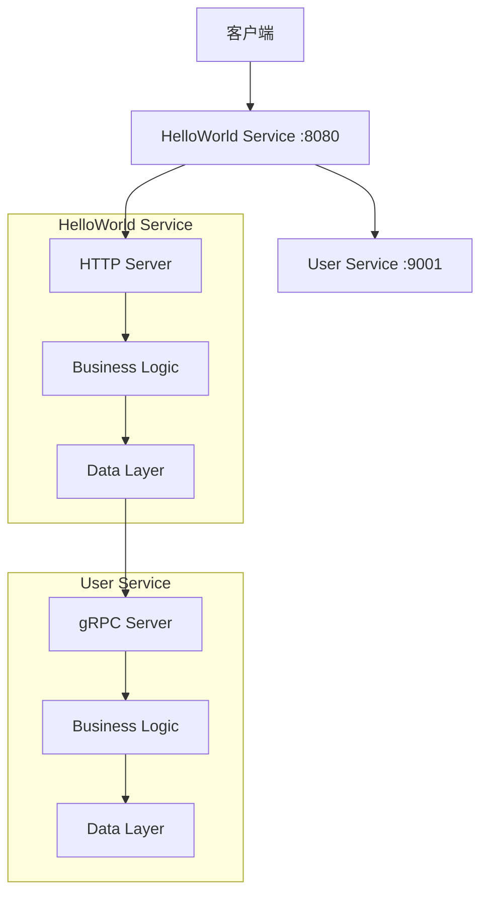

# TinyID 微服务架构

这是一个使用 Rust 构建的现代微服务架构项目，展示了如何构建可扩展、可维护的微服务系统。

## 🏗️ 架构概览

项目采用 Cargo Workspace 结构，包含以下组件：

```
tinyid/
├── libs/shared/           # 共享库（配置、错误处理、tracing等）
├── services/
│   ├── user/             # 用户服务（gRPC）
│   └── helloworld/       # HelloWorld服务（HTTP + gRPC客户端）
├── api/                  # Protobuf API定义
├── scripts/              # 启动脚本
├── docker/               # Docker配置
└── docker-compose.yml    # Docker Compose配置
```

### 服务架构



## 🚀 快速开始

### 前置要求

- Rust 1.75+
- Protocol Buffers 编译器 (protoc)
- Docker & Docker Compose (可选)

### 本地开发

1. **克隆项目**
```bash
git clone <repository-url>
cd tinyid
```

2. **构建所有服务**
```bash
cargo build --release
```

3. **启动所有服务**
```bash
./scripts/start-all-services.sh
```

4. **测试服务**
```bash
# 健康检查
curl http://localhost:8080/health

# 生成ID
curl http://localhost:8080/id

# Hello World（无用户信息）
curl http://localhost:8080/hello

# Hello World（带用户信息）
curl "http://localhost:8080/hello?user_id=1&message=Custom%20Message"

# 获取用户信息
curl http://localhost:8080/users/1
```

5. **停止所有服务**
```bash
./scripts/stop-all-services.sh
```

### 使用 Docker

1. **构建并启动**
```bash
docker-compose up --build
```

2. **停止服务**
```bash
docker-compose down
```

## 📋 API 文档

### HelloWorld Service (HTTP - Port 8080)

| 端点 | 方法 | 描述 | 示例 |
|------|------|------|------|
| `/` | GET | 服务信息 | `curl http://localhost:8080/` |
| `/health` | GET | 健康检查 | `curl http://localhost:8080/health` |
| `/id` | GET | 生成ID | `curl http://localhost:8080/id` |
| `/hello` | GET | Hello World（查询参数） | `curl "http://localhost:8080/hello?user_id=1"` |
| `/hello` | POST | Hello World（JSON请求） | `curl -X POST -H "Content-Type: application/json" -d '{"user_id":1}' http://localhost:8080/hello` |
| `/users/:id` | GET | 获取用户信息 | `curl http://localhost:8080/users/1` |

### User Service (gRPC - Port 9001)

User Service 提供以下 gRPC 方法：
- `GetUser` - 根据ID获取用户
- `CreateUser` - 创建新用户
- `UpdateUser` - 更新用户信息
- `DeleteUser` - 删除用户
- `ListUsers` - 列出用户（分页）

## 🏛️ 架构设计

### 分层架构

每个服务都采用清晰的分层架构：

```
Service/
├── server/           # 服务启动层
│   └── main.rs      # 服务入口点
├── service/         # 服务层（HTTP/gRPC处理）
├── biz/             # 业务逻辑层
├── data/            # 数据访问层
└── error.rs         # 错误定义
```

### 设计原则

1. **单一职责**: 每个服务专注于特定的业务领域
2. **依赖注入**: 通过抽象接口解耦组件
3. **配置驱动**: 通过环境变量和配置文件管理
4. **可观测性**: 内置 tracing 和 metrics
5. **错误处理**: 统一的错误处理和传播

### 关键特性

- **类型安全**: 利用 Rust 的类型系统保证安全性
- **异步处理**: 基于 Tokio 的高性能异步运行时
- **gRPC 通信**: 服务间使用 gRPC 进行高效通信
- **HTTP API**: 对外提供 RESTful HTTP 接口
- **配置管理**: 灵活的配置系统支持多环境
- **链路追踪**: 集成 OpenTelemetry 支持分布式追踪
- **容器化**: 完整的 Docker 支持

## 🔧 开发指南

### 添加新服务

1. **创建服务目录**
```bash
mkdir -p services/new-service/src/{server,service,biz,data}
```

2. **添加到 Workspace**
```toml
# Cargo.toml
[workspace]
members = [
    "libs/shared",
    "services/user",
    "services/helloworld",
    "services/new-service",  # 新增
]
```

3. **实现分层架构**
- `server/main.rs` - 服务启动
- `service/` - API 层
- `biz/` - 业务逻辑
- `data/` - 数据访问

### 配置管理

服务配置通过环境变量管理，支持嵌套结构：

```bash
# 基础配置
export APP_NAME="my-service"
export APP_HOST="0.0.0.0"
export APP_PORT="8080"

# 嵌套配置
export APP_TRACING__ENABLED="true"
export APP_TRACING__SERVICE_NAME="my-service"

# 数组配置
export APP_DEPENDENCIES__0__NAME="user-service"
export APP_DEPENDENCIES__0__HOST="localhost"
export APP_DEPENDENCIES__0__PORT="9001"
```

### 测试

```bash
# 运行所有测试
cargo test

# 运行特定服务的测试
cargo test --manifest-path services/user/Cargo.toml

# 运行集成测试
cargo test --test integration
```

## 📊 监控和观测

### 日志

服务使用结构化日志，支持多种输出格式：
- 开发环境：人类可读格式
- 生产环境：JSON 格式

### 链路追踪

集成 OpenTelemetry，支持：
- Jaeger
- Zipkin  
- OTLP 协议

### 健康检查

每个服务都提供健康检查端点：
- User Service: gRPC 健康检查
- HelloWorld Service: `GET /health`

## 🚀 部署

### 本地部署

使用提供的脚本：
```bash
./scripts/start-all-services.sh
```

### Docker 部署

```bash
docker-compose up -d
```

### 生产部署

建议使用 Kubernetes，可以参考以下配置：

```yaml
# 示例 Kubernetes 配置
apiVersion: apps/v1
kind: Deployment
metadata:
  name: user-service
spec:
  replicas: 3
  selector:
    matchLabels:
      app: user-service
  template:
    metadata:
      labels:
        app: user-service
    spec:
      containers:
      - name: user-service
        image: tinyid/user-service:latest
        ports:
        - containerPort: 9001
        env:
        - name: APP_ENVIRONMENT
          value: "production"
```

## 🤝 贡献

1. Fork 项目
2. 创建特性分支 (`git checkout -b feature/amazing-feature`)
3. 提交更改 (`git commit -m 'Add some amazing feature'`)
4. 推送到分支 (`git push origin feature/amazing-feature`)
5. 打开 Pull Request

## 📄 许可证

本项目采用 MIT 许可证 - 查看 [LICENSE](LICENSE) 文件了解详情。

## 🙏 致谢

- [Tokio](https://tokio.rs/) - 异步运行时
- [Tonic](https://github.com/hyperium/tonic) - gRPC 实现
- [Axum](https://github.com/tokio-rs/axum) - Web 框架
- [Tracing](https://github.com/tokio-rs/tracing) - 结构化日志和追踪